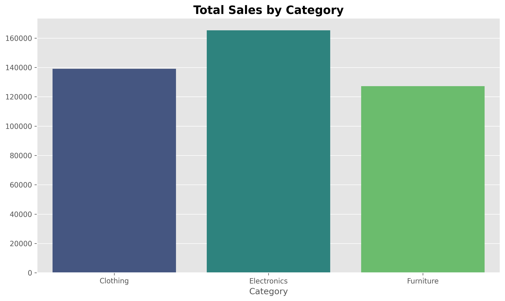
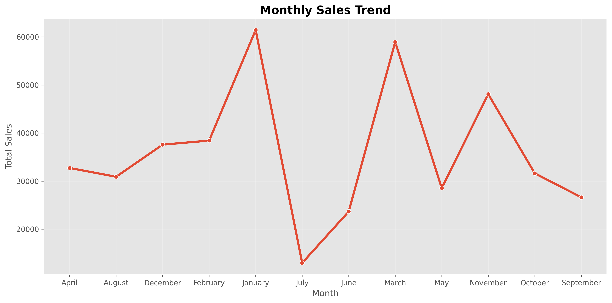
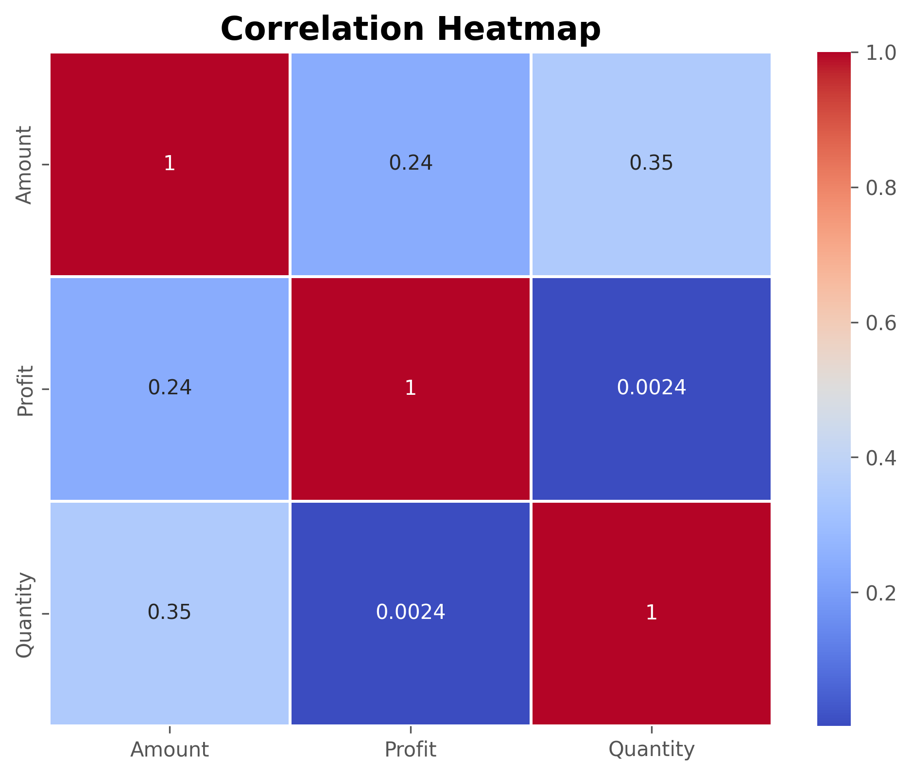

E-Commerce Sales Exploratory Data Analysis (EDA) Dashboard
🚀 Project Overview

This project performs Exploratory Data Analysis (EDA) on an e-commerce sales dataset to extract meaningful business insights.
It helps understand sales trends, profitability, customer behavior, and category performance using Python and data visualization techniques.

The goal is to support data-driven business decision-making through clear and actionable insights.

📸 Dashboard Preview

  

📊 Category Contribution Analysis

  

📈 Monthly Sales Trend

  

🌍 State-wise Sales Analysis

  

🔥 Correlation Heatmap

  

🎯 Problem Statement

Businesses generate large amounts of sales data but often struggle to extract meaningful insights.
This project aims to analyze e-commerce data to identify:

Top-performing categories
Sales and profit trends
Regional performance
Customer purchasing behavior
🛠️ Tech Stack
Python 🐍
Pandas
NumPy
Matplotlib
Seaborn
Jupyter Notebook
📂 Dataset Information
Total Records: 1500
Total Features: 11
Missing Values: 0
Data Type: Structured Sales Dataset
📊 Key Analysis Performed
Data Cleaning & Preprocessing
Exploratory Data Analysis (EDA)
Sales Distribution Analysis
Category-wise Performance
Profit Analysis
Monthly Trend Analysis
State-wise Performance
Correlation Analysis
Customer Segmentation
Category Contribution Analysis
🔍 Key Insights
Electronics is the highest revenue-generating category
Clothing shows the highest profitability
January recorded peak sales performance
Madhya Pradesh is the top-performing state
Electronics contributes ~38% of total sales
A small group of customers generates majority of revenue
Weak correlation exists between sales and profit (0.24)
💡 Business Recommendations
Increase focus on Electronics category for revenue growth
Expand Clothing product line due to high profitability
Replicate successful seasonal strategies across months
Strengthen marketing in high-performing regions
Improve pricing strategy for better profit margins
Introduce loyalty programs for high-value customers
📁 Project Structure
Ecommerce_Sales_EDA/
│
├── data/
│   └── sales_dataset.csv
│
├── images/
│   ├── category_sales.png
│   ├── category_contribution.png
│   ├── monthly_sales_trend.png
│   ├── state_sales.png
│   ├── correlation_heatmap.png
│
├── EDA_Analysis.ipynb
├── requirements.txt
└── README.md
🚀 How to Run This Project
# Step 1: Clone repository
git clone https://github.com/samlgawade14-crypto/ecommerce-sales-eda-analysis

# Step 2: Move into project folder
cd ecommerce-sales-eda-analysis

# Step 3: Install required libraries
pip install -r requirements.txt

# Step 4: Run Jupyter Notebook
jupyter notebook
🧠 Learning Outcomes
Real-world data cleaning and preprocessing
Advanced exploratory data analysis techniques
Business insight generation from raw data
Data visualization best practices
Professional GitHub project structuring
📌 Conclusion

This project successfully identifies key sales and profitability patterns in an e-commerce dataset.
The insights generated can help businesses improve revenue growth, customer targeting, and strategic decision-making.

👨‍💻 Author

Samruddhi Laxman Gawade
GitHub: samlgawade14-crypto

⭐ If you like this project

Give it a ⭐ on GitHub and feel free to fork or improve it!
